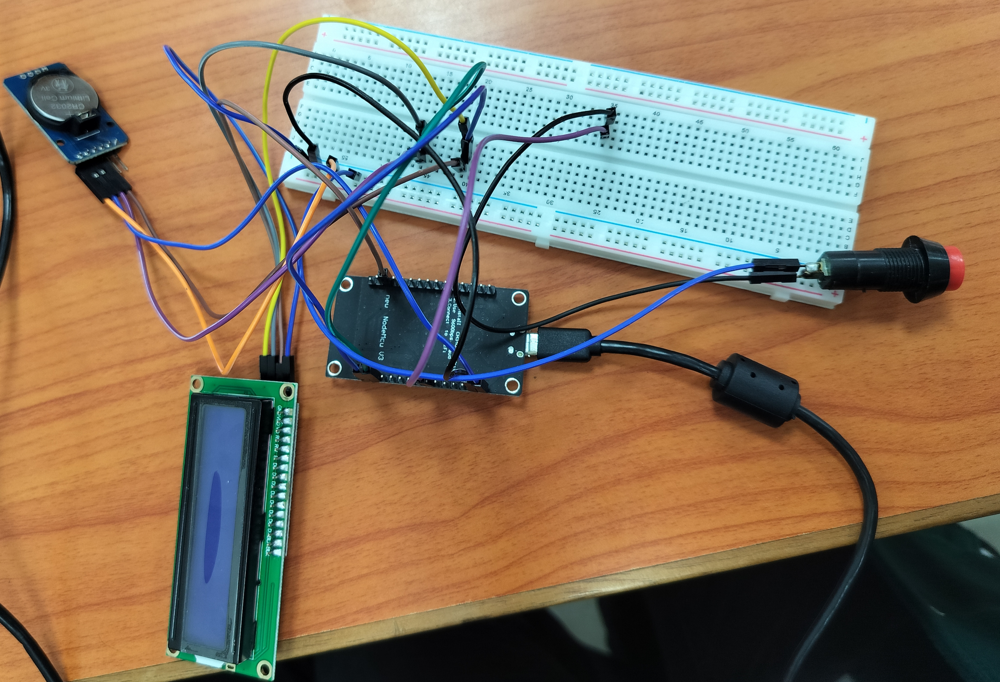
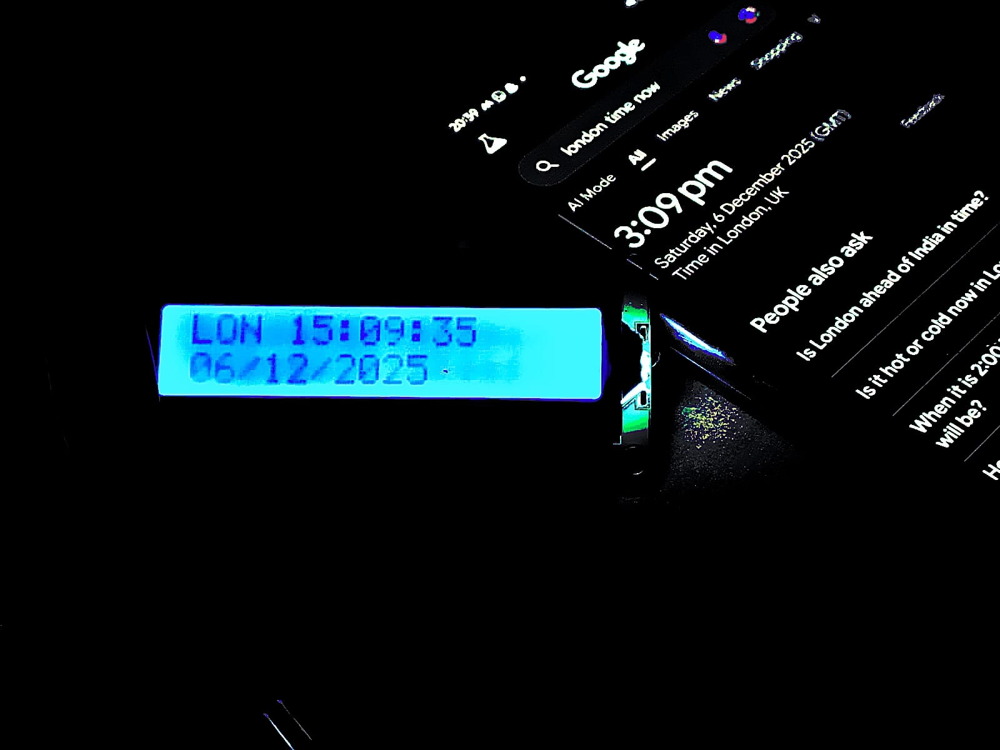
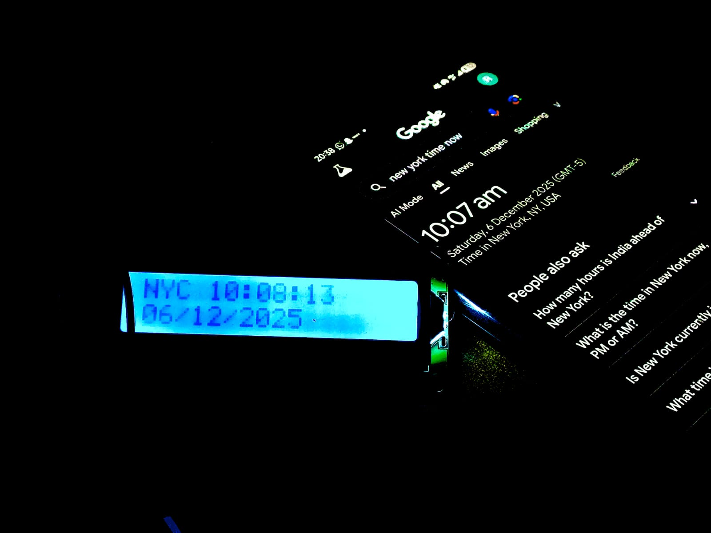
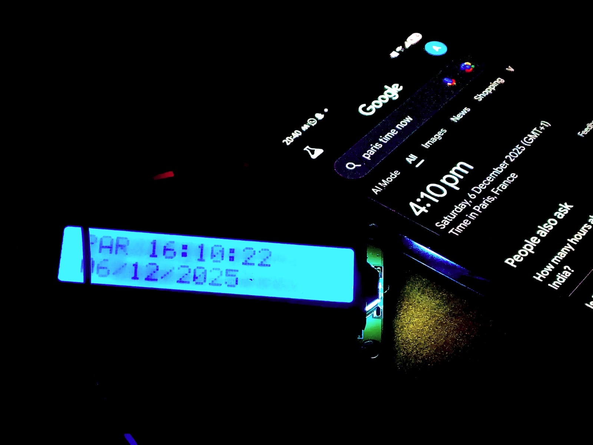
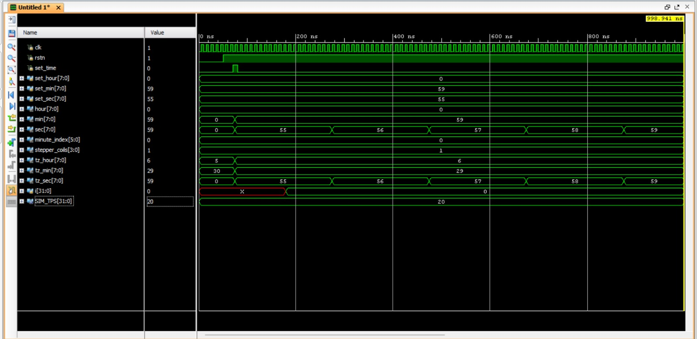
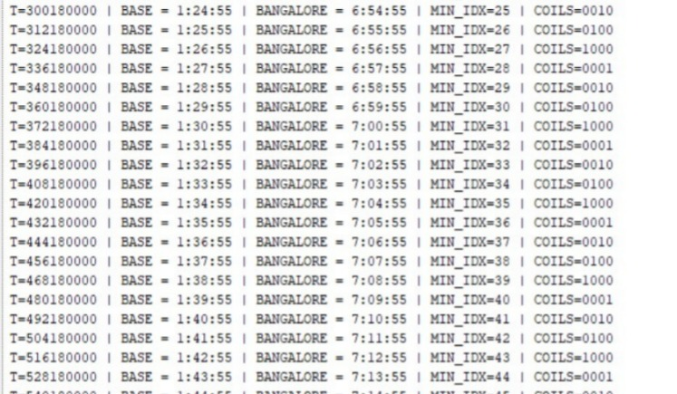

# Hybrid World Clock

## Overview

A hybrid embedded world clock that combines ESP8266-based digital timekeeping with Verilog-based analog clock simulation. The system synchronizes time using NTP servers, maintains accuracy through a DS3231 RTC backup, and supports multiple global time zones through a push-button interface.

## Features

* NTP Time Synchronization
* DS3231 RTC Backup
* 20 Global Time Zones
* LCD Time and Date Display
* Push Button Timezone Selection
* Verilog Analog Clock Simulation
* Stepper Motor Control Logic

## Hardware Used

* ESP8266 NodeMCU
* DS3231 RTC Module
* 16x2 I2C LCD
* Push Button
* Breadboard and Jumper Wires

## Software Used

* Arduino IDE
* Vivado
* Verilog HDL

## Project Files

### Arduino

* world_clock.ino

### Verilog

* top_clock.v
* stepper_ctrl.v
* tb_clock.v

## Team Members

* Abhisri R Bammanni
* Adithi A
* Ananya A Deshpande
* Astha S Gramopadhye

## Team Contributions

* **Abhisri R Bammanni** – Hardware integration and circuit implementation.
* **Adithi A** – RTC and LCD interfacing, testing and validation.
* **Ananya A Deshpande** – ESP8266 programming, Verilog design and simulation.
* **Astha S Gramopadhye** – System verification, documentation and result analysis.

## Project Demonstration

### Hardware Setup

### London Time Verification

### New York Time Verification

### Paris Time Verification

### Vivado Simulation Waveform

### Simulation Console Output

## Future Work

* Physical Stepper Motor Implementation
* FPGA Deployment
* ESP32 Migration
* Dynamic Timezone Updates
* Real-Time Analog Clock Hardware Integration
